# CS203 Lab 7

## Team Number: 33

## Team Members

### Member 1

- Name: Vivek Raj
- Roll No: 23110362
- Github: VivekRaj2708

### Member 2

- Name: Sharvari Mirge
- Roll No: 23110298
- Github: msharvari31

## Repository Details

- Repository Link: <a href="https://github.com/VivekRaj2708/LAB7_CS203">https://github.com/VivekRaj2708/LAB7_CS203</a>

<br />

<div style="page-break-after: always;"></div>

# Dataset

## Download

We download 3 different datasets for training our MLP Model. These datasets names are given below

1. Train.TSV (Dataset - 1)
2. Test.TSV (Dataset - 1)
3. IMDB.CSV (Dataset - 2)

```bash
curl https://raw.githubusercontent.com/clairett/pytorch-sentiment-classification/master/data/SST2/train.tsv -o train.tsv
curl https://raw.githubusercontent.com/clairett/pytorch-sentiment-classification/master/data/SST2/test.tsv -o test.tsv
curl https://raw.githubusercontent.com/Ankit152/IMDB-sentiment-analysis/master/IMDB-Dataset.csv -o IMDB.csv
```


## Imports

We importedthe folowing modules

1. `pandas`: For Reading CSV Files and X, y splitting using `iloc`
2. `train_test_split`: From `sklearn` to split the dataset into training and validation datasets
3. `matplotlib`: To visualise the current dataset sizes

```python
from sklearn.model_selection import train_test_split
import pandas as pd
import matplotlib.pyplot as plt
```

## Reading and Splitting

As mentioned above we will read the tsv files using the pandas module and spilt into X_train and X_validation

```python
data = pd.read_csv('train.tsv', sep='\t')
test_data = pd.read_csv('test.tsv', sep='\t')

X = data.iloc[:, 0]
y = data.iloc[:, 1]
X_test = test_data.iloc[:, 0]
y_test = test_data.iloc[:, 1]

X_train, X_validation, y_train, y_validation = train_test_split(X, y, test_size=0.2, random_state=20)
```

<div style="page-break-after: always;"></div>

## Dataset Sizes

The dataset sizes given to us are shown in the following bar graph:

### Dataset 1

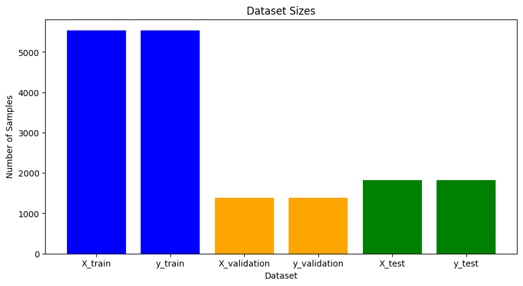

### Dataset 2

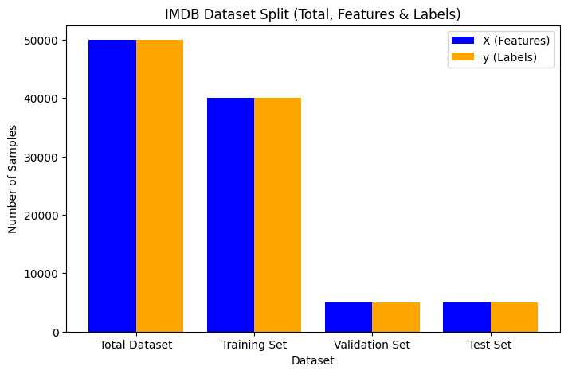

<div style="page-break-after: always;"></div>

# Imports

| Module Name                  | Import                                                                 | Reason for Import                                                    |
| ---------------------------- | ---------------------------------------------------------------------- | -------------------------------------------------------------------- |
| `torch`                      | `nn`                                                                   | Provides neural network layers and loss functions                    |
| `torch`                      | `optim`                                                                | Contains optimizers for training models (e.g., Adam)                 |
| `torch`                      | `utils.data`                                                           | Handles dataset loading and batching                                 |
| `torch.utils`                | `tensorboard`                                                          | Logs training metrics for TensorBoard visualization                  |
| `torchsummary`               | `summary`                                                              | Displays model architecture summary                                  |
| `transformers`               | `DistilBertTokenizer`, `DistilBertModel`, `AutoTokenizer`, `AutoModel` | Loads pre-trained transformer models and tokenizers                  |
| `sklearn`                    | `metrics`                                                              | Computes evaluation metrics (accuracy, precision, recall)            |
| `sklearn.feature_extraction` | `text`                                                                 | Converts text data into numerical features (e.g., CountVectorizer)   |
| `tensorflow`                 | `tensorflow`                                                           | Used for deep learning tasks                                         |
| `gzip`                       | `gzip`                                                                 | Compresses and decompresses model checkpoints                        |
| `pickle`                     | `pickle`                                                               | Serializes and deserializes Python objects (e.g., model state dicts) |
| `numpy`                      | `numpy`                                                                | Performs numerical operations                                        |
| `pandas`                     | `pandas`                                                               | Handles data manipulation and analysis                               |
| `matplotlib`                 | `pyplot`                                                               | Plots data visualizations                                            |
| `seaborn`                    | `sns`                                                                  | Creates statistical data visualizations                              |
| `tqdm`                       | `notebook`                                                             | Displays progress bars in Jupyter Notebook                           |

<div style="page-break-after: always;"></div>

# Checkpointing

## `save_checkpoint`

This function **saves the model's weights** in a compressed `.gz` format to reduce storage space.

```python
import torch
import gzip
import pickle

def save_checkpoint(model, path="checkpoint.pt.gz"):
    checkpoint = {
        "model_state_dict": model.state_dict()
    }
    with gzip.open(path, 'wb') as f:
        pickle.dump(checkpoint, f)

    print(f"Model weights saved successfully to {path}")
```

## `load_checkpoint`

This function **loads the model's weights** from a compressed `.gz` file.

```python
import torch
import gzip
import pickle

def load_checkpoint(model, path="checkpoint.pt.gz"):
    with gzip.open(path, 'rb') as f:
        checkpoint = pickle.load(f)
    model.load_state_dict(checkpoint["model_state_dict"])
    print(f"Model weights loaded successfully from {path}")
```

<div style="page-break-after: always;"></div>

# TensorBoard

TensorBoard is a powerful tool for visualizing and tracking deep learning experiments. It provides interactive dashboards to analyze different aspects of model training.

1. **Track Training Progress**

   - Plots loss, accuracy, and other metrics over time.
   - Helps in diagnosing overfitting or underfitting.

2. **Monitor Weights and Gradients**

   - Displays histograms of parameter distributions.
   - Helps in detecting vanishing or exploding gradients.

3. **Compare Multiple Experiments**
   - Enables hyperparameter tuning by visualizing different runs.
   - Helps in selecting the best-performing model.

## Current Run:

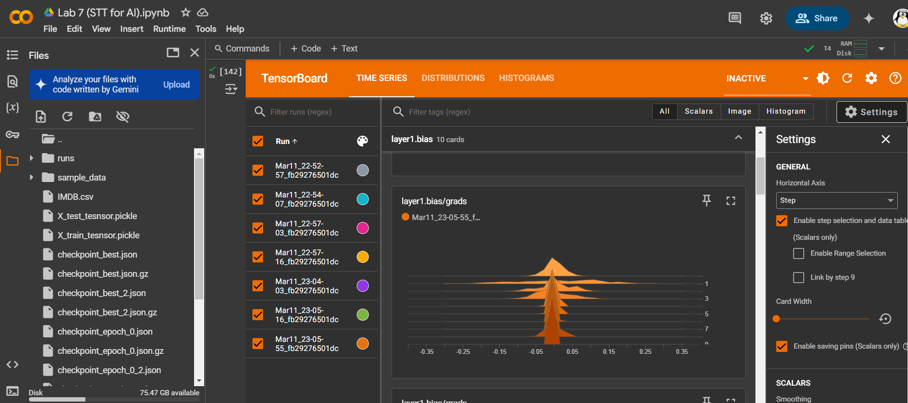

<br />

<div style="page-break-after: always;"></div>

# MLP (Case - 1)

## ML Architecture

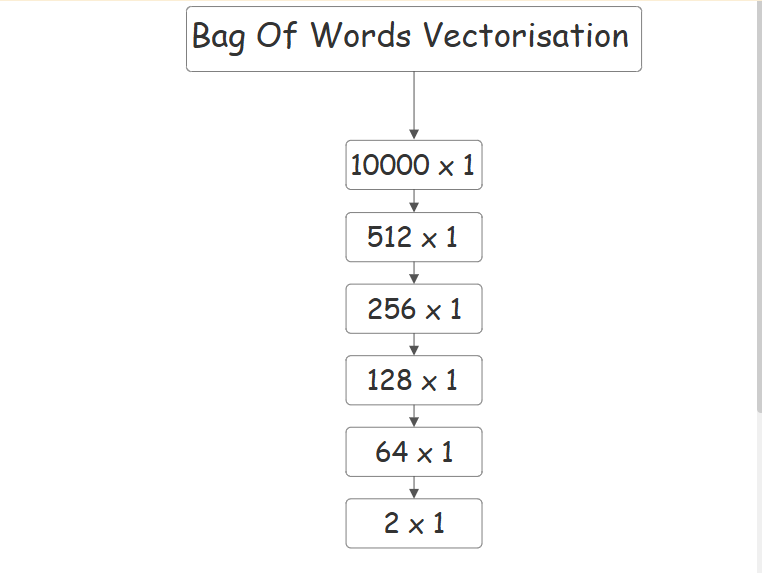

<div style="page-break-after: always;"></div>

## Model

```python
class MLP(nn.Module):
    def __init__(self) -> None:
        super(MLP, self).__init__()
        self.layer1 = nn.Linear(10000, 512)
        self.layer2 = nn.Linear(512, 256)
        self.layer3 = nn.Linear(256, 128)
        self.layer4 = nn.Linear(128, 64)
        self.layer5 = nn.Linear(64, 2)

        self.activation = nn.ReLU()
        self.dropout = nn.Dropout(p=0.3)

    def forward(self, x):
        x = self.dropout(self.activation(self.layer1(x)))
        x = self.dropout(self.activation(self.layer2(x)))
        x = self.dropout(self.activation(self.layer3(x)))
        x = self.dropout(self.activation(self.layer4(x)))
        x = self.layer5(x)

        return x
```
<div style="page-break-after: always;"></div>

## Model Outputs

```
MLP(
  (layer1): Linear(in_features=10000, out_features=512, bias=True)
  (layer2): Linear(in_features=512, out_features=256, bias=True)
  (layer3): Linear(in_features=256, out_features=128, bias=True)
  (layer4): Linear(in_features=128, out_features=64, bias=True)
  (layer5): Linear(in_features=64, out_features=2, bias=True)
  (activation): ReLU()
  (dropout): Dropout(p=0.3, inplace=False)
)
----------------------------------------------------------------
        Layer (type)               Output Shape         Param #
================================================================
            Linear-1               [-1, 1, 512]       5,120,512
              ReLU-2               [-1, 1, 512]               0
           Dropout-3               [-1, 1, 512]               0
            Linear-4               [-1, 1, 256]         131,328
              ReLU-5               [-1, 1, 256]               0
           Dropout-6               [-1, 1, 256]               0
            Linear-7               [-1, 1, 128]          32,896
              ReLU-8               [-1, 1, 128]               0
           Dropout-9               [-1, 1, 128]               0
           Linear-10                [-1, 1, 64]           8,256
             ReLU-11                [-1, 1, 64]               0
          Dropout-12                [-1, 1, 64]               0
           Linear-13                 [-1, 1, 2]             130
================================================================
Total params: 5,293,122
Trainable params: 5,293,122
Non-trainable params: 0
----------------------------------------------------------------
Input size (MB): 0.04
Forward/backward pass size (MB): 0.02
Params size (MB): 20.19
Estimated Total Size (MB): 20.25
```

<div style="page-break-after: always;"></div>

## Bag of Words Vectorisation (Count Vector)

We need to convert textual data into numerical representations using the Bag-of-Words (BoW) model with `CountVectorizer` from `sklearn.feature_extraction.text` to train our MLP

```python
vectorizer = CountVectorizer(max_features=10000)
X_train_bow = vectorizer.fit_transform(X_train)
X_validation_bow = vectorizer.transform(X_validation)
X_test_bow = vectorizer.transform(X_test)
```

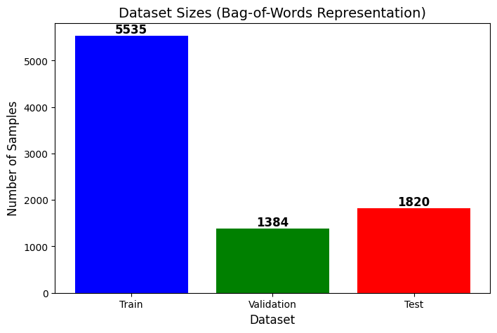

<div style="page-break-after: always;"></div>

## Training Curve

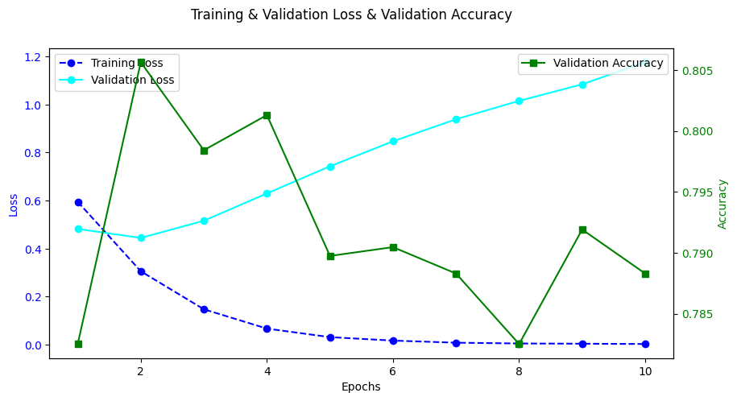

### Observation

1. Training Loss (Blue, Dashed Line)

   - Starts relatively high and gradually decreases, which is expected as the model learns from the data.
   - A steady decline suggests that the model is effectively minimizing the error on the training data.

2. Validation Loss (Cyan, Solid Line)

   - Unlike training loss, validation loss starts lower but increases over time.
   - This could indicate overfitting, where the model is performing well on training data but not generalizing well to unseen validation data.

3. Validation Accuracy (Green, Solid Line)

   - Initially increases sharply, peaking around Epoch 2.
   - However, it fluctuates after that, indicating that the model might not be consistently improving on validation data.
   - The final accuracy value suggests a decent performance

<div style="page-break-after: always;"></div>

# MLP (Case 2)

## LLama3-Embedder

The Embedder class is designed to generate text embeddings using the **Llama 3.1-8B model from Meta**. It tokenizes input text, passes it through the model, and extracts meaningful vector representations.

```python
class Embedder:
    def __init__(self):
        self.tokenizer = AutoTokenizer.from_pretrained("meta-llama/Llama-3.1-8B")
        self.model = AutoModel.from_pretrained("meta-llama/Llama-3.1-8B").to(device)
        self.embedding_size = self.model.config.hidden_size
        self.tokenizer.pad_token = self.tokenizer.eos_token
        self.model_loaded = True

    def get_embeddings(self, text):
        inputs = self.tokenizer(text, return_tensors="pt", padding=True, truncation=True, max_length=32).to(device)
        with torch.no_grad():
            outputs = self.model(**inputs)
        return outputs.last_hidden_state.mean(dim=1)
```

## Model


```python
class MLP2(nn.Module):
    def __init__(self, input_layer=4096) -> None:
        super(MLP2, self).__init__()
        self.layer1 = nn.Linear(input_layer, 512)
        self.layer2 = nn.Linear(512, 256)
        self.layer3 = nn.Linear(256, 128)
        self.layer4 = nn.Linear(128, 64)
        self.layer5 = nn.Linear(64, 2)

        self.activation = nn.ReLU()
        self.dropout = nn.Dropout(p=0.3)

    def forward(self, x):
        x = self.dropout(self.activation(self.layer1(x)))
        x = self.dropout(self.activation(self.layer2(x)))
        x = self.dropout(self.activation(self.layer3(x)))
        x = self.dropout(self.activation(self.layer4(x)))
        x = self.layer5(x)

        return x
```

<div style="page-break-after: always;"></div>

## Training Curve

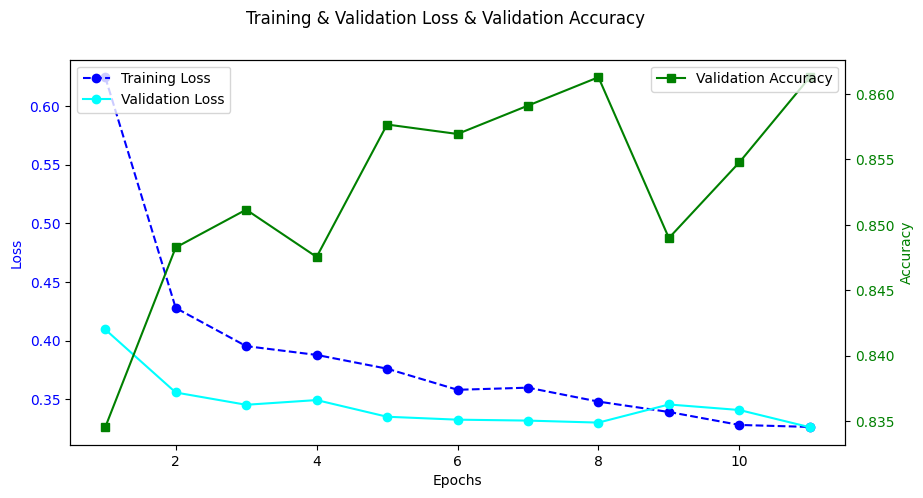

### Observation

1. Training Loss (Blue, Dashed Line, Circular Markers)

   - Decreases over time, indicating the model is learning from the training data.

2. Validation Loss (Cyan, Solid Line, Circular Markers)

   - Initially decreases but stabilizes, suggesting the model generalizes well.

3. Validation Accuracy (Green, Solid Line, Square Markers)
   - Increases with epochs, meaning the model's performance on unseen data is improving.

<div style="page-break-after: always;"></div>

# IMDB (Case - 1)

## Bag of Words

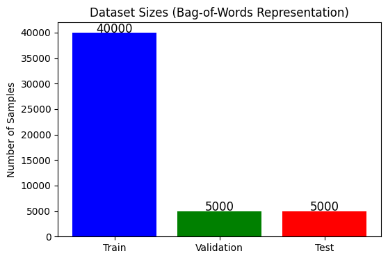

1. Train Dataset (Blue Bar)

   - Contains 40,000 samples, which is significantly larger than the other two datasets.
   - This is because training a model typically requires the largest dataset to learn effectively.

2. Validation Dataset (Green Bar)

   - Contains 5,000 samples, used to fine-tune hyperparameters and monitor overfitting.

3. Test Dataset (Red Bar)

   - Also contains 5,000 samples, used to evaluate the final model performance.

## Training Curve

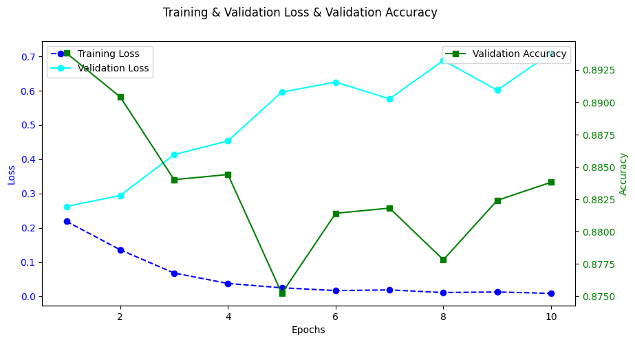

### Observation

1. Training Loss (Blue, Dashed Line)

   - Starts relatively high and gradually decreases, which is expected as the model learns from the data.
   - A steady decline suggests that the model is effectively minimizing the error on the training data.

2. Validation Loss (Cyan, Solid Line)

   - Unlike training loss, validation loss starts lower but increases over time.
   - This could indicate overfitting, where the model is performing well on training data but not generalizing well to unseen validation data.

3. Validation Accuracy (Green, Solid Line)

   - Increases overall, indicating that the model is improving its performance on unseen data.
   - Some fluctuations suggest the model is adjusting its parameters dynamically.

<div style="page-break-after: always;"></div>

## Confusion Matrix

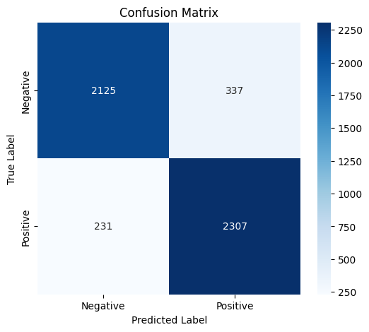

1. High true positives and true negatives indicate good overall performance.
2. `337` false positives may indicate a need to fine-tune decision thresholds.
3. `231` false negatives suggest recall improvement strategies, such as data balancing or adjusting loss

<div style="page-break-after: always;"></div>

## Evaluation Matrix

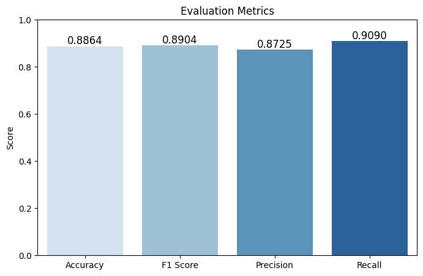

This bar chart represents the key evaluation metrics for the model’s performance:

**1. Accuracy (0.8864)**

- The proportion of correctly classified instances out of all predictions.
- **88.64%** accuracy suggests strong overall performance.

**2. F1 Score (0.8904)**

- The harmonic mean of **precision** and **recall**.
- A high F1 score (~89%) indicates a balanced model with strong performance in both identifying positives and minimizing false positives/negatives.

**3. Precision (0.8725)**

- The proportion of true positive predictions out of all positive predictions made.
- **87.25%** precision suggests that most of the predicted positives are indeed correct.

**4. Recall (0.9090)**

- The proportion of actual positive instances correctly identified.
- **90.90%** recall suggests the model effectively captures most positive cases.


<div style="page-break-after: always;"></div>

# IMDB (Case - 2)

## Training Curve

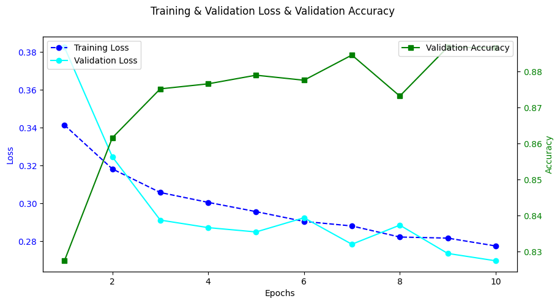

### Observation

1. **Training Loss (blue dashed line)**

   - Starts high but decreases steadily, indicating that the model is learning effectively.

2. **Validation Loss (cyan solid line)**

   - Initially high but drops significantly, then stabilizes.
   - A small increase after epoch 6 suggests possible **overfitting**.

3. **Validation Accuracy (green line, right axis)**
   - Increases initially and stabilizes around **88%**.
   - A slight dip around epoch 7, followed by an increase, shows minor fluctuations.

<div style="page-break-after: always;"></div>

## Confusion Matrix

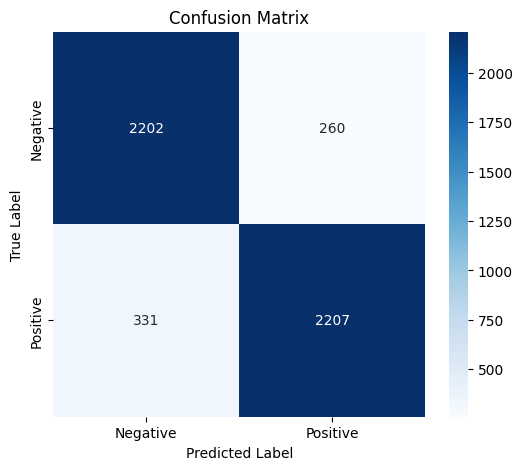

1. **High True Positives & True Negatives**

   - The model correctly classifies most negative and positive samples.

2. **Misclassification Cases (FP & FN)**

   - **False Positives (260 cases):** Some negative samples were misclassified as positive.
   - **False Negatives (331 cases):** Some positive samples were misclassified as negative.

3. **Potential Improvements**
   - Adjusting decision thresholds to reduce false negatives.
   - Implementing better feature engineering or handling class imbalance.

<div style="page-break-after: always;"></div>

## Evaluation Matrics

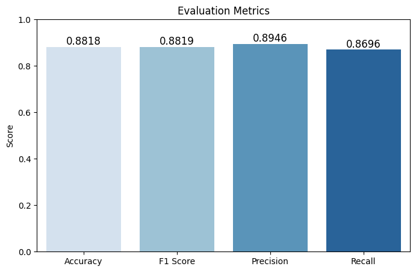

### **Metrics Breakdown**

- **Accuracy:** **0.8818** → The proportion of correctly classified samples.
- **F1 Score:** **0.8819** → The harmonic mean of precision and recall.
- **Precision:** **0.8946** → The proportion of correctly predicted positive cases.
- **Recall:** **0.8696** → The proportion of actual positive cases correctly identified.

### **Observation**

1. **Balanced Performance**

   - Accuracy and F1 score are close, indicating a well-performing model.
   - Precision is slightly higher than recall, suggesting fewer false positives.

2. **Potential Trade-offs**
   - If false negatives are costly, increasing recall might be beneficial.
   - If false positives are critical, precision should be prioritized.

<div style="page-break-after: always;"></div>

# Comaprison BoW vs Embedding System

## **1. Evaluation Metrics**

| Metric        | BoW    | Embed  |
| ------------- | ------ | ------ |
| **Accuracy**  | 0.8864 | 0.8818 |
| **F1 Score**  | 0.8904 | 0.8819 |
| **Precision** | 0.8725 | 0.8946 |
| **Recall**    | 0.9090 | 0.8696 |

---

## **2. Performance Analysis**

1. **Accuracy**
   - BoW (0.8864) is slightly higher than Embed (0.8818), meaning BoW has slightly better overall correctness.
2. **F1 Score**

   - BoW (0.8904) is slightly higher than Embed (0.8819), indicating better balance between precision and recall.

3. **Precision**

   - Embed (0.8946) outperforms BoW (0.8725), meaning it makes fewer false positive errors.

4. **Recall**
   - BoW (0.9090) is higher than Embed (0.8696), meaning BoW identifies more positive instances correctly.

---

## **3. Conclusion**

- **BoW performs better in recall**, meaning it captures more positive cases correctly but at the cost of slightly lower precision.
- **Embed has higher precision**, meaning it makes fewer false positives but at the cost of lower recall.
- **Overall, BoW slightly outperforms Embed in accuracy and F1-score**, but the choice depends on whether **recall (BoW)** or **precision (Embed)** is more important for the specific task.
